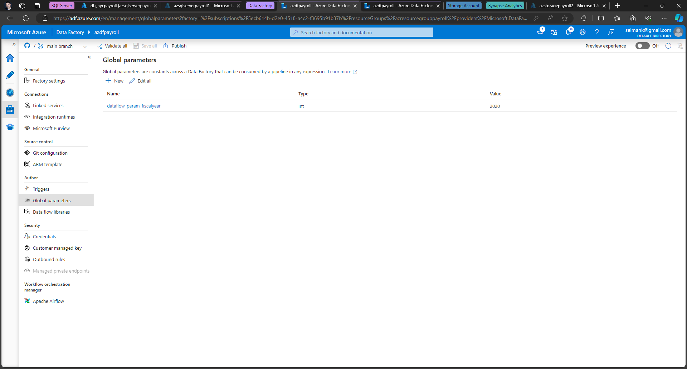

By Selman Karaosmanoglu

## Date created
22 May 2024

# NYC Payroll Data Analytics Pipeline

## Project Overview

**Creating Data Analytics Pipeline**

The City of New York aims to develop a **Data Analytics platform** on Azure Synapse Analytics with two main objectives:
- Financial Resource Analysis: To analyze the allocation of the City's financial resources and the budget devoted to overtime.
- Public Data Availability: To make salary and overtime pay data for all municipal employees available to the public.

Dynamic, automatable, and monitorable data pipelines to ensure efficient operation will be created. The project includes quality assurance experts to test and improve data quality.

###  Data Sources
- the CSV files with the master data and monthly payroll data from various City agencies.

###  NYC Payroll DB Schema

## Instructions

### Step 1: Create resources

#### 1.1 Azure Data Lake Gen2: Create a storage account and container. Ensure hierarchical namespace are enabled.
#### 1.2 Azure Data Factory: Set up the Data Factory resource for data integration. 
#### 1.3 Azure SQL Database: Create a SQL Database named `db_nycpayroll` with basic service tier and networking configurations.

In Networking tab, allow both of the below options:

- Allow Azure services and resources to access this server
- Add current client IP address

#### 1.4 Azure Synapse Analytics: Create a workspace. 

### Step 2: Azure Data Lake: Create container, directories and upload CSV files

Create three directories in the storage container named:
- `dirpayrollfiles`
- `dirhistoryfiles`
- `dirstaging`

`dirstaging` will be used by the pipelines to store staging data for integration with Azure Synapse.

Upload these files to the `dirpayrollfiles` folder

- `EmpMaster.csv`
- `AgencyMaster.csv`
- `TitleMaster.csv`
- `nycpayroll_2021.csv`

Upload this file (historical data) to the `dirhistoryfiles` folder

- `nycpayroll_2020.csv`

### Step 3: Azure Sql Database: Create Tables

Create tables with the sql script. The script is in `scripts/az_sqldb_createtables.sql`

### Step 4: Azure Synapse: Create Database and External Table

1. Create database with serverless SQL pool for data processing. 
2. Create external table pointing to the `dir_staging`. The script is in `scripts/az_synapsedb_createexternaltable.sql`

### Step 5: Azure Data Factory: Linked Services Creation
Add linked services to Azure Data Factory.

- Create a linked service to the data lake
- Create a linked service to the Azure Sql Database

### Step 6: Azure Data Factory: Datasets Creation

In Azure Data Factory: 
- Create the datasets for the csv files in the Data Lake
- Create the datasets for the tables in the Azure Sql Database
- Create the dataset for staging directory in the datalake.

### Step 7: Azure Data Factory: Data Flows Creation

Create the dataflows that loads csv files to the sql database tables.

### Step 8: Aggregate Data Flow

In this step, the 2021 year data and historical data will be extracted, merged, aggregated and stored in DataLake staging area which will be used by Synapse Analytics external table. The aggregation will be on Agency Name, Fiscal Year and TotalPaid.

1. Create new data flow and name it Dataflow Summary
2. Add source as payroll 2020 data from SQL DB
3. Add another source as payroll 2021 data from SQL DB
4. Create a new Union activity and select both payroll datasets as the source
5. Make sure to do any source to target mappings if required. This can be done by adding a Select activity before Union
6. After Union, add a Filter activity, go to Expression builder
- Create a parameter named- dataflow_param_fiscalyear and give value 2020 or 2021
- Include expression to be used for filtering: toInteger(FiscalYear) >= $dataflow_param_fiscalyear
7. Now, choose Derived Column after filter
- Name the column: TotalPaid
- Add following expression: RegularGrossPaid + TotalOTPaid+TotalOtherPay
8. Add an Aggregate activity to the data flow next to the TotalPaid activity
- Under Group by, select AgencyName and FiscalYear
- Set the expression to sum(TotalPaid)
9. Add a Sink activity after the Aggregate
- Select the sink as summary table created in SQL db
- In Settings, tick Truncate table
10. Add another Sink activity, this will create two sinks after Aggregate
- Select the sink as dirstaging in Azure DataLake Gen2 storage
- In Settings, tick Clear the folder

### Step 9: Create pipeline

1. Create a new pipeline
2. Include dataflows for Agency, Employee and Title to be parallel
3. Add dataflows for payroll 2020 and payroll 2021. These should run only after the initial 3 dataflows have completed
4. After payroll 2020 and payroll 2021 dataflows have completed, dataflow for aggregation should be started.

Final pipeline looks like this:

### Step 10: Create global parameter

Create a new Global Parameter. This will be the Parameter at the global pipeline level that will be passed on to the data flow `dataflow_param_fiscalyear` parameter.

### Step 11: Trigger and Monitor pipeline

1. Select Add trigger option from pipeline view in the toolbar
2. Choose trigger now to initiate pipeline run
3. Go to monitor tab and check the Pipeline Runs
4. Each dataflow will have an entry in Activity runs list

### Step 12: Verify Pipeline run artifacts

1. Query data in SQL DB summary table (destination table). This is one of the sinks defined in the pipeline.

2. Check the dirstaging directory in Datalake if files got created. This is one of the sinks defined in the pipeline

3. Query data in Synapse external table that points to the dirstaging directory in Datalake.

### Step 13: GitHub Integration

1. Login to your Github account and create a new Repo in Github
2. Connect Azure Data Factory to Github
3. Select your Github repository in Azure Data Factory
4. Publish all objects to the repository in Azure Data Factory

## Requirements

Microsoft Azure: Azure Data Factory, Azure Synapse, Azure Data Lake Gen2, Azure Sql Database

## Credits
Udacity Data Engineer Nanodegree Program